# Bayesian ML Human Trafficking

**Date:** March 29, 2026

**Group members:** Bhavya Sharma, Jiwon Choi, Noah Fisher, Sieon Lee, and Mateo Galvis

## Agenda
1. [Problem Statement](#problem-statement)
2. [Datasets](#datasets)
3. [EDA](#eda) 
4. [Methodology](#methodology)
    * [Model 1: Bayesian State Space Decomposition](#model-1-bayesian-state-space-decomposition)
    * [Model 2: Hierarchical Beta Binomial](#model-2-hierarchical-beta-binomial)
    * [Model 3: Bayesian Resource Optimizer](#model-3-bayesian-resource-optimizer)
5. [Conclusions and next steps](#conclusions-and-next-steps)

## Problem Statement
Human trafficking is a silent pandemic that our world is facing with 49.6 M victims in modern
slavery globally. Almost 80% of victims globally face a gap in access to reintegration services
after rehabilitation. Fragmented case management data across agencies exist in silos and there is
no comprehensive solution to this problem. We look at the data on victim services in the United
States to understand the trends in this sector.

Three structural challenges make conventional statistical approaches inadequate:

**(1) The Dark Figure Problem:** The vast majority of trafficking victims are never identified by any reporting system. Hotline calls, grantee caseloads, and law enforcement records each capture a different, incomplete slice of the same hidden population. No single source reflects true prevalence, and the gap between reporting volume and actual incidence is unknown by definition.

**(2) Data Sparsity and Inconsistency:** Victim characteristics, means of control, and exploitation types are inconsistently recorded across data sources, time periods, and geographies. Missing values are not random — they cluster in early years, low-capacity regions, and high-sensitivity cases, making naive imputation strategies unreliable.

**(3) The Cost of Being Wrong is Asymmetric:** In shelter resource planning, a false positive (an empty bed) wastes money. A false negative (a victim turned away) is a humanitarian catastrophe. Standard point-estimate models that optimize for accuracy treat these two errors as equivalent which is a deeply inappropriate assumption in this domain.

This project directly addresses all three challenges through a pipeline of Bayesian probabilistic models. Rather than producing a single deterministic forecast, our framework propagates uncertainty at every stage (from victim prevalence estimation to demographic profiling to resource allocation) and deliberately builds in a safety margin that reflects the true asymmetry of cost in anti-trafficking work.

## Datasets

| Dataset | Structure | Role | Strength | Source | Limitation |
|---------|-----------|------|----------|--------|------------|
| Polaris U.S. Hotline FY13–FY24 | 12 rows × 5 cols | Detection / awareness proxy | Long, consistent | [Polaris Project](https://polarisproject.org/resources/us-national-human-trafficking-hotline-statistics/) | Selection bias; methodology shifts |
| OVC PMT Grantee Data (FY23–FY24) | 8 rows × 8 cols | Service capacity proxy | Federally audited | [OVC / OJP](https://ovc.ojp.gov/funding/performance-measures/human-trafficking) | Capacity-constrained, not prevalence |
| CTDC Global Dataset (2002–2019) | 48K rows × 63 cols | Victim characteristics | Rich covariates | [CTDC](https://www.ctdatacollaborative.org/global-dataset) | Identification, not population, sample |
| ILO Global Estimates of Modern Slavery | 12 published summary tables segmented by region, sex, age, and exploitation typology | External anchor / prior | Cross-national | [CTDC / ILO](https://www.ctdatacollaborative.org/page/global-estimates-modern-slavery-forced-labour-and-forced-marriage-2022) | Estimation methodology contested |
| TIP Report (State Dept.) | 30 rows × 6 cols | Country-tier covariates | Annual, comprehensive | [State Dept.](https://www.state.gov/trafficking-in-persons-report) | Diplomatic/political weighting |
| BJS NCVS supplements & FBI NIBRS | ~240,000 impacted persons records per year across six linked segment files at the agency-incident level | U.S. crime baseline | Probability sample | [BJS / OJP](https://bjs.ojp.gov/data-collection/ncvs) | Trafficking severely underreported |

## EDA

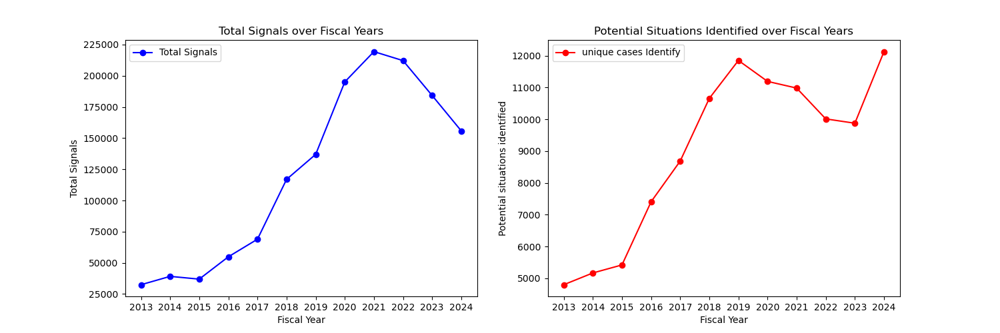 
The timeseries plot shows that the Total Signals have been increasing since 2013 until 2021, with a downward trend from 2021 to 2024. However, the potential situations identified got their highest value in 2024, with 12K victims found, despite a negative trend from 2019 to 2023, probably related to the COVID period.

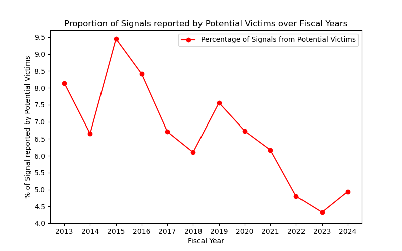 
The proportion of signals reported by potential victims has constantly decreased over the last decade, reaching a minimum of 5%. This timeseries plot suggests that the victims have been less listened to, depending more on witnesses, family, friends, law enforcement, or anonymous reporters.

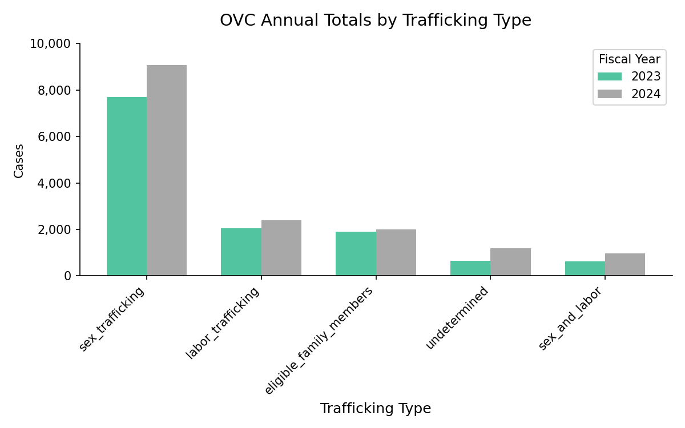 
The OVC displays that in recent years, the most common cause is sex trafficking, increasing from 7,686 victims served in 2023 to 9,066 in 2024, followed by labor trafficking, with 2,403 in 2024, in contrast with 2,056 in 2023. It is essential that governance start tracking these metrics to develop more efficient public policies that reduce the number of victims.

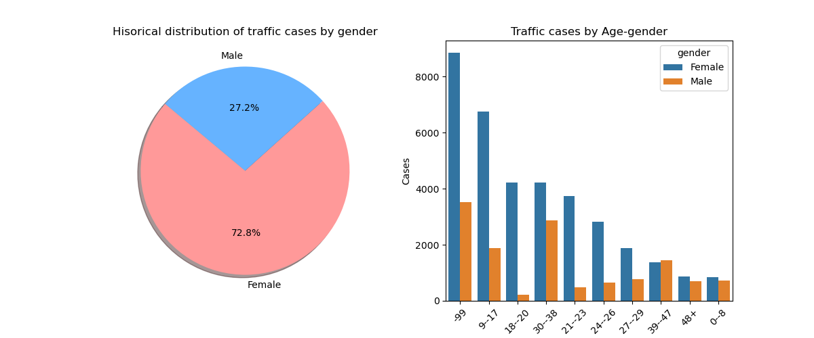 
The pie chart shows that 72.8% of human traffic is female. Taking a closer look, by age, the most affected are 9-17 and 18-20 year olds, the most likely target victims are teenagers and young adults. In the case of Men, they represents 27% of the human trafficking cases, and the most frequent age group is 18-20 years old.

## Methodology

### Model 1: Bayesian State Space Decomposition
The idea behind developing this type of model was to identify how potential situations of human trafficking are evolving over time and whether public policy decisions are improving the identified cases. Therefore, the FOSTA policy intervention of 2018 was taken as a reference.

The Bayesian structural time series implemented was using PyMC:
   1.	Separating trend + policy effect + noise
   2.	Estimating everything probabilistically with MCMC (NUTS)
   3.	Extracting a "cleaned" residual signal after removing the structure
      
$$y_t = \text{trend}_t + \text{policy effect}_t + \text{noise}_t$$
* $$\text{trend}_t =$$ slowly evolving hidden baseline
* $$\text{policy effect}_t =$$ step change starting in 2018
* $$\text{noise}_t =$$ observation randomness

**Results:**

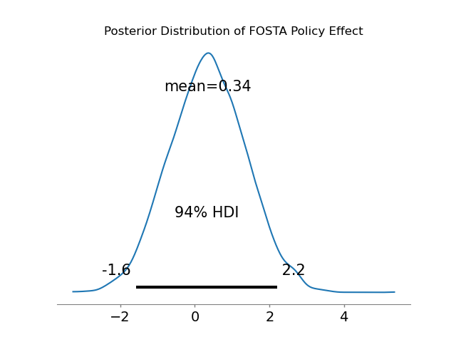 
Posterior Distribution: The model estimates that FOSTA increased the number of situations identified by 0.34, but the HDI is between -1.58 and +2.20, which crosses zero, leading to uncertainty about the policy's impact. 

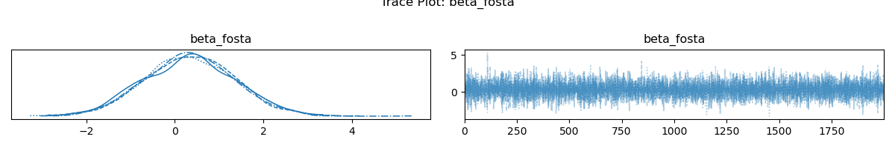 
Trace plot: All the chains agree on the same shape, indicating strong convergence. As in the previous graph, the model suggests a positive policy effect, but the zero value appears within the interval; the variance is too wide to be conclusive. 

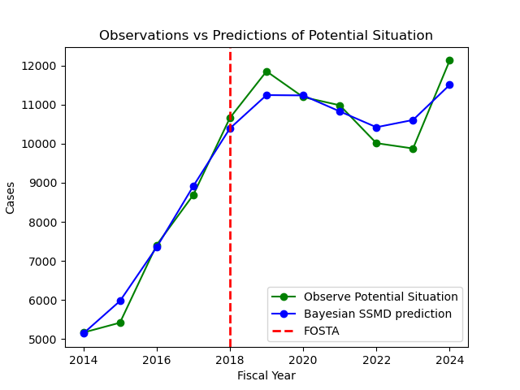 
The observation vs. prediction time series shows strong performance; the model was able to learn the trend and level, handle the policy effect, and control the noise in the data.

This type of model can help decompose and evaluate how decisions and resource allocation related to human trafficking assistance affect victims.

### Model 2: Hierarchical Beta Binomial

The idea behind this model is to estimate the prevalence of each means_of_control while pooling information within each exploitation_type (for example, forced labor and sex trafficking). This helps stabilize estimates when some categories have low sample sizes.

The Bayesian hierarchical Beta-Binomial model implemented in PyMC was structured as:

1. Defining group-level priors for each exploitation type (mu, kappa)
2. Mapping each row to group-specific Beta parameters (alpha, beta)
3. Estimating row-level latent prevalence (theta) with partial pooling
4. Linking observed counts through a Binomial likelihood

For each row $i$ in group $g(i)$:

$$
\begin{aligned}
\mu_g &\sim \mathrm{Beta}(1,1) \\
\kappa_g &\sim \mathrm{Pareto}(1,1.5) \\
\theta_i &\sim \mathrm{Beta}(\mu_{g(i)}\kappa_{g(i)}, (1-\mu_{g(i)})\kappa_{g(i)}) \\
y_i &\sim \mathrm{Binomial}(n_i, \theta_i)
\end{aligned}
$$

Where $y_i$ is the observed positive count, $n_i$ is the observed total count, and $\theta_i$ is the pooled prevalence estimate.

**Model 2 figures**

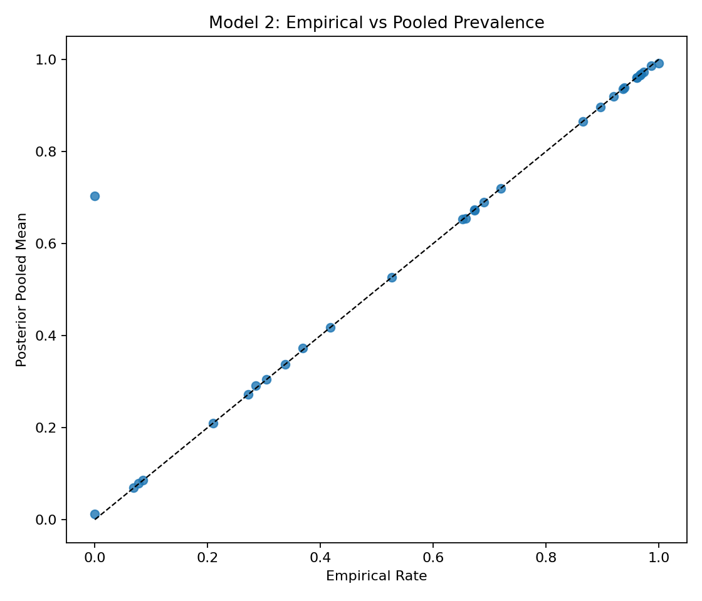 
**Figure 1. Empirical vs pooled prevalence.** Points close to the diagonal indicate categories with enough data to stand largely on their own. Off-diagonal adjustments show where hierarchical pooling regularizes sparse categories toward more plausible group-level values.

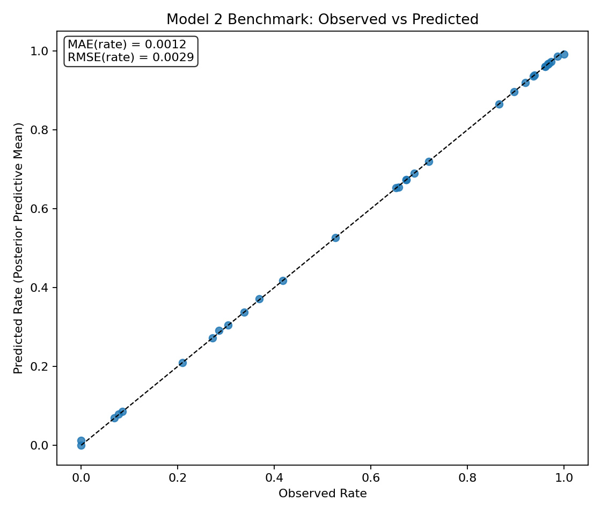 
**Figure 2. Observed vs predicted benchmark.** Posterior predictive means closely track observed category-level rates, indicating that the model reproduces the overall prevalence structure well.

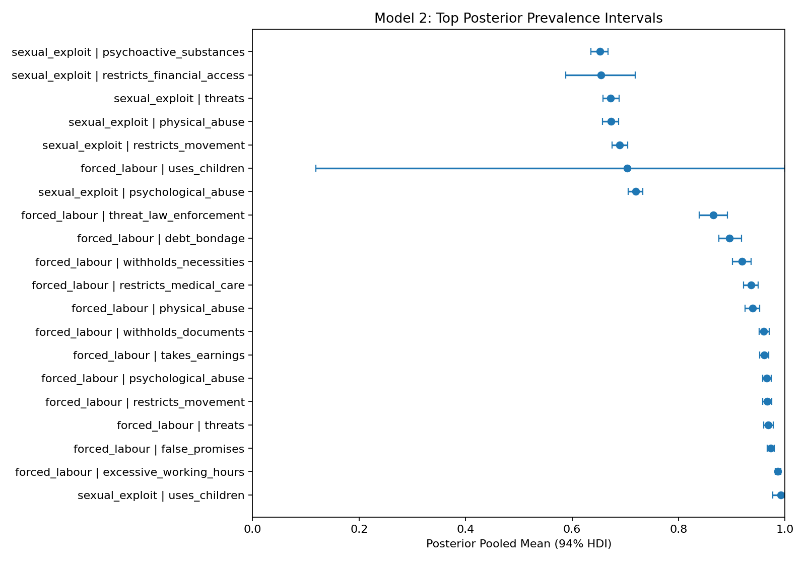 
**Figure 3. Posterior intervals by category.** The interval widths show uncertainty around each prevalence estimate and highlight where additional data collection would be most valuable.

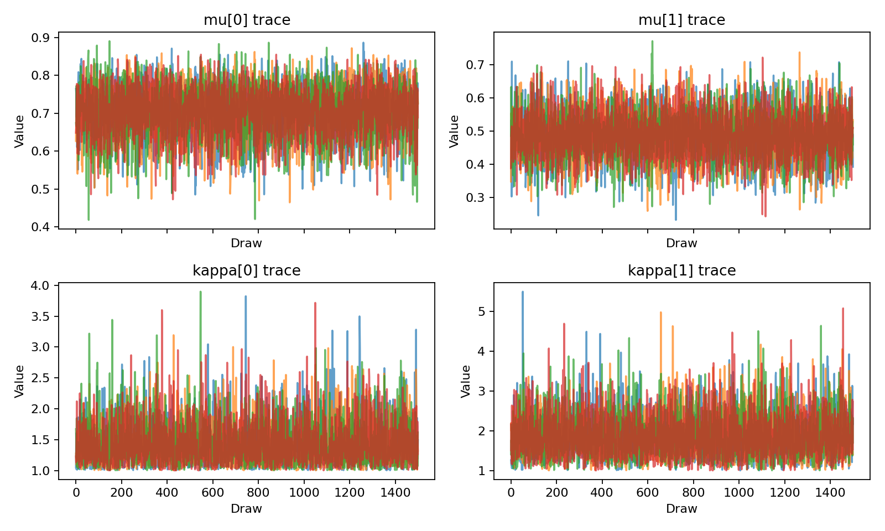 
**Figure 4. Trace diagnostics for `mu` and `kappa`.** The chains mix cleanly in this run, supporting stable posterior summaries for the group-level parameters.

**Benchmark metrics (posterior predictive):**
- MAE (count): 0.4106
- RMSE (count): 0.4627
- MAE (rate): 0.0012
- RMSE (rate): 0.0029

These results indicate strong in-sample calibration for category-level prevalence, while preserving uncertainty quantification for sparse groups.

### Model 3: Bayesian Resource Optimizer

The idea behind this model is to turn uncertain victim-service demand into a practical resource allocation plan. Instead of using only observed service totals, the model simulates future demand and chooses the allocation that minimizes expected policy loss.

The Bayesian resource optimizer was structured as:

1. Generate posterior predictive demand scenarios from FY2023-FY2024 OVC quarterly service data
2. Adjust demand using the residual signal from Model 1 and service-risk weights from Model 2
3. Apply an asymmetric LINEX loss function that penalizes unmet demand more heavily than unused capacity
4. Use SLSQP to find the lowest-loss allocation under a fixed budget constraint

The loss function compares allocated capacity with simulated future demand for each service category. When demand is higher than capacity, the penalty rises sharply; when capacity is higher than demand, the penalty grows more slowly. The final allocation is chosen by minimizing expected LINEX loss while keeping total cost within the available budget.

This allows the model to redistribute limited service capacity toward categories where unmet demand is expected to be most costly.

**Model 3 figures**

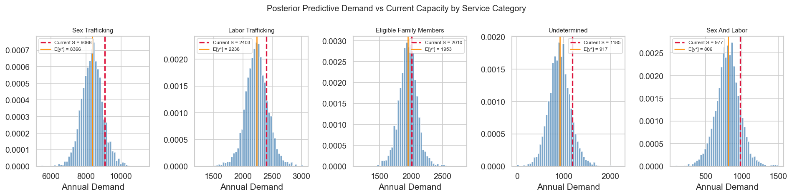 
**Figure 1. Posterior predictive demand scenarios.** The distributions compare projected annual service demand with current FY2024 service delivery across the five OVC service categories.

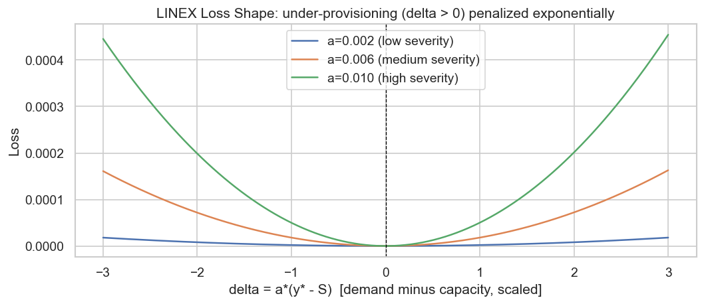 
**Figure 2. LINEX loss function.** Under-provisioning produces a much steeper penalty than over-provisioning, reflecting the higher policy cost of unmet victim-service demand.

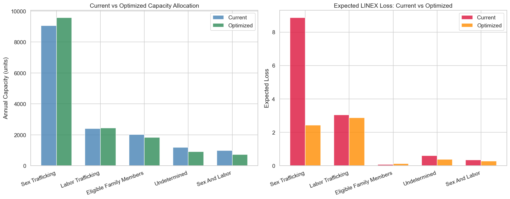 
**Figure 3. Current vs optimized allocation.** The SLSQP optimizer reallocates cost-weighted capacity across service categories to reduce expected LINEX loss under the same budget constraint.

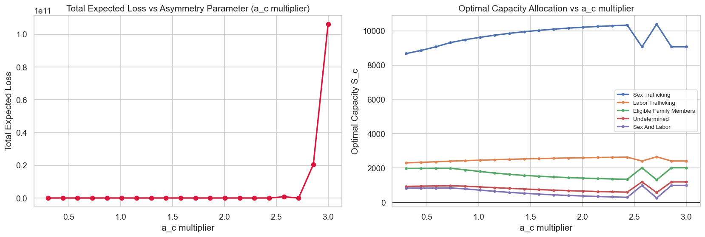 
**Figure 4. Asymmetry sensitivity analysis.** Varying the LINEX asymmetry parameter shows how stronger penalties for under-provisioning shift the optimal allocation.

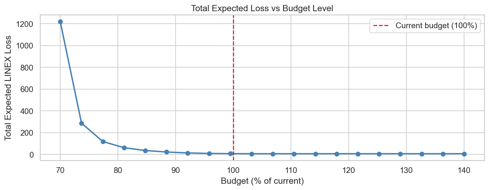 
**Figure 5. Budget sensitivity analysis.** The expected loss curve shows how policy loss changes as the available budget increases or decreases relative to the current service level.

These results provide a decision-theoretic bridge between Bayesian inference and policy implementation. Rather than only estimating demand, Model 3 recommends how limited service resources should be allocated under uncertainty.

## Conclusions and next steps
